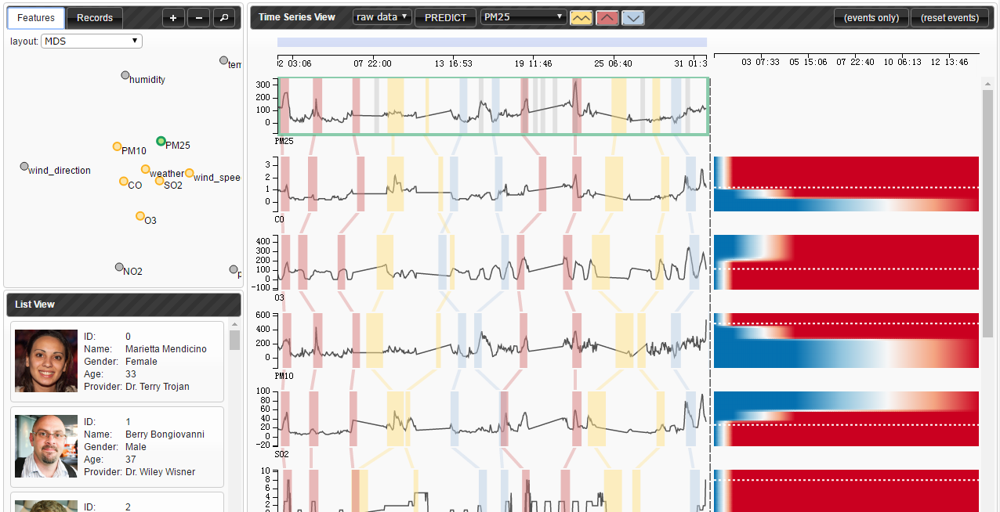

---
title:
date: 2017-07-27 09:48:16
type: "about"
comments: false
---

## 林涵菲 Hanfei Lin
 Web前端 · 数据可视化方向 

***

## <i class="fa fa-graduation-cap" aria-hidden="true" align=left ></i>  教育背景 Education

> **华东师范大学（ECNU）**    *2012.9 - 2016.6*

* 计算机科学与软件工程学院 · 本科学位
* GPA: 3.6 / 4.0

> **伊利诺伊大学香槟分校（UIUC）**  *2017.8 - 今*

* 计算机科学 · 硕士在读

***

##  <i class="fa fa-wrench" aria-hidden="true" align=left ></i> 专业技能 Skills

JavaScript | Python | Java | C++ | Django | Node. JS | Angular JS | FLASK | html5 | CSS

***

## <i class="fa fa-laptop" aria-hidden="true" align=left ></i> 工作经历 Work Experiences

> **智能与大数据可视化实验室, 同济大学** *（2016年9月 – 2017年6月）*
研究助理

* 实现了一个用于异常事件预测分析的可视化系统。
* 允许用户在多维时序数据集上标记事件、选取感兴趣的数据样本和特征作为生存回归模型的输入、使用热力图可视化地展现模型的预测结果。
* 负责前端及部分后端的代码编写。

> **可视化实验室， 上海纽约大学**  *（2016年1月 – 2016年9月）*
研究助理

* 设计并实现了一个智能可视化系统RCLens，能够使用户实时参与和反馈异常类的检测过程。
*   设计并实现了用户友好界面，与团队所设计的LOFRCD算法无缝对接。在阿里巴巴安全小组的真实网络攻击场景下进行了测试，并被证实与传统的手工检测相比，在检测速度和检测精度方面有了极大提升。
* 负责前端及部分后端的代码编写。

> **ALM组，软件开发部门，惠普** *（2016年1月 – 2016年9月）*
软件开发工程师（实习生）

*  参与实现惠普核心软件产品ALM Octane（软件开发生命周期管理系统）的前端部分。
*  参与实现ALM Qot（基于移动端的软件管理系统）的前端部分。

***

## <i class="fa fa-list-alt" aria-hidden="true" align=left ></i> 项目经历 Projects

> **基于Storyline的可视化技术分析与应用** *（2015年9月 – 2016年5月）*
毕业设计

*  设计并实现了一个用于布局Storyline的横向切片模型，  将聚类概念引入Storyline中，与传统布局方式相比在运行效率与布局效果上都更加优势。
*  获得华东师范大学优秀毕业论文。

> **过程可视化编译器** *（2014年3月 – 2015年3月）*
系统设计者与开发者

* 设计并实现了一个过程可视化教学辅助编译器，能够动态地呈现编译过程中每个步骤的结果，并对编译算法在运行时的机理(如：语法分析中的分析栈)也能动态显示。通过一个学期的教学实践，该可视化编译器在《编译原理》课程的教学中起着良好的辅助作用。
*  使用C#语言进行编写。团队共三人。

> **面向儿童的3D交互式心理沙盘系统** *（2014年3月 – 2015年3月）*
系统设计者与开发者

* 设计并实现了一个3D交互式心理沙盘，仿真真实沙盘的物品放置以及挖沙功能，额外提供环境切换，录屏功能以及治疗师反馈功能。系统包含双客户端。
*  使用Unity实现3D界面，MySQL进行数据存储，C#进行双客户端编写。团队共五人。
*  项目获得国家级大学生创新训练基金（10000元）以及华东师范大学大夏基金（2000元）支持。

***

##  <i class="fa fa-pencil" aria-hidden="true" align=left ></i> 出版作品 Publications

*  ["RCLens: Interactive Rare Category Exploration and Identification"](http://xueshu.baidu.com/s?wd=paperuri%3A%287f49b14062b68c19e5c5dafa9283a6da%29&filter=sc_long_sign&tn=SE_xueshusource_2kduw22v&sc_vurl=http%3A%2F%2Fieeexplore.ieee.org%2Fdocument%2F7939996%2F&ie=utf-8&sc_us=11894303932935657617), H. Lin; S. Gao; D. Gotz; F. Du; J. He; N. Cao, in IEEE Transactions on Visualization and Computer Graphics , vol.PP, no.99, pp.1-1

*  ["过程可视化编译器的设计与应用"](http://image.hanspub.org:8080/pdf/SEA20150500000_75311317.pdf), 林涵菲，陈希文，梁雨霏，琚小明, 软件工程与应用, 2015, 4(5), 89-95

*  ["A Process-Visible Compiler Aimed for Teaching Assistant"](http://www.atlantis-press.com/php/pub.php?publication=cetcu-15&frame=http%3A//www.atlantis-press.com/php/paper-details.php%3Fid%3D25846823), X. Chen; H. Lin; Y. Liang; X. Ju, in 2015 Conference on Education and Teaching in Colleges and Universities

***

## <i class="fa fa-trophy" aria-hidden="true" align=left ></i> 曾获奖项 Honors

*2016*	上海市优秀毕业生

*2015*	国家奖学金

*2015*	美国大学生数学建模竞赛二等奖

*2014*	“大夏杯”课外学术科技作品大赛三等奖

*2014*	Sandisk创新型社会奖学金

*2014*	优秀学生一等奖学金

*2013*	优秀学生二等奖学金

***

## <i class="fa fa-user-circle-o" aria-hidden="true" align=left ></i> 其它属性 Attributes

*  **典型B型血白羊座** 热情而冲动，向往自由，爱挑战，爱创造，不记仇，极强求知欲，脑洞突破天际。
*  **最喜欢的人物** 灰原哀、巴卫和仓央嘉措
*  **最喜欢的书** 《红楼梦》《飘》和《护花铃》
*  **兴趣爱好** 各种奇怪的运动、狼人杀、密室逃脱、唱歌、画画、写小说、吃旺旺仙贝
